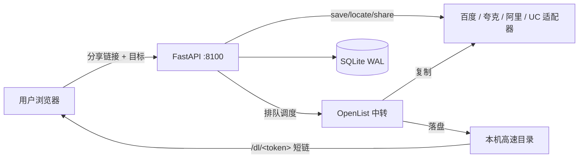

# pan-transfer

跨平台网盘转存服务：粘贴一条分享链接，把文件转存到自己的网盘（或本机），再生成干净的下载/分享链接。前后端单容器部署，基于 [OpenList](https://github.com/OpenListTeam/OpenList)（AList 社区延续版）做跨盘中转。



## 功能特性

**转存**

- 多平台：百度网盘 / 夸克 / 阿里云盘 / UC（Cookie 或 token 接入）+ 本机高速（落盘自托管）
- 跨平台搬运：源盘 save → OpenList 中转复制 → 目标盘 locate → 生成新分享（全程文件级引用，不泄漏目录兄弟内容）
- 组合转存（管理员）：一条链接 → 最多 5 个目标，组内串行、源盘只保存一次、按组取消/删除
- 文件夹分享支持：源分享整体含文件夹时整树转存、按目录名定位
- 大文件保护：单文件上限预检（百度 8GB / 夸克 20GB，可配），超限转 `needs_confirm` 由用户选择跳过继续
- 中转看门狗：OpenList 停滞检测（分钟级零增长判死）、反复重下载侦测（防「转存到超限盘」死循环）、重启孤儿任务回收

**下载**

- 本机高速：`/dl/<token>` 短链直下（URL 不含文件名，真实名走 Content-Disposition），原生 Range 断点续传
- 多文件任务给清单页；支持子目录相对路径下载
- CF 边缘缓存开关（多用户重复下载吃 CDN）+ 任务删除自动 Purge
- 下载计数：Range 分片不计次 + (客户端, 文件) 去重

**安全与多用户**

- 三种登录方式二选一：访问口令（普通）/ 管理员口令（派生 token）/ [Linux.do Connect](https://connect.linux.do) OAuth2（可选）
- Linux.do 登录：一次性 state 防 CSRF、回程 token 走 URL fragment 不落日志、trust_level/active/silenced 可校验、owner 由服务端从 token 强制派生（防水平越权）、跨设备同一身份
- 登录限速（10 次/分/IP）、常数时间 token 比较、任务按 owner 隔离、/dl 链接即凭证（任务删除即失效）
- 和谐文件检测：list 可见但 md5 特征异常的文件，转存被拒时直接告知「已被百度和谐」

**体验**

- 转存记录分页、实时进度（下载/上传分相计量）、Bark 完成推送（可选）
- 日/夜间主题、访客态预览（未登录不可交互）、并发排队提示

## 部署

前置：一台装了 Docker 的机器，以及一个 [OpenList](https://github.com/OpenListTeam/OpenList) 实例（已挂载各网盘）。

```bash
git clone <本仓库>
cd pan-transfer
cp .env.example .env      # 填写口令与网盘凭据
docker compose up -d --build
```

打开 `http://<host>:8100` 即可（生产建议置于反向代理/Cloudflare Tunnel 之后）。

### 配置参考

全部配置在 `.env`（键值说明见 `.env.example` 内注释），主要项：

| 变量 | 说明 |
|------|------|
| `APP_PASSWORD` / `ADMIN_PASSWORD` | 访问口令 / 管理员口令（至少设一个，两者都空则仅本机可用） |
| `OPENLIST_BASE` / `OPENLIST_TOKEN` | OpenList 地址（容器内 `http://openlist:5244`）与 token |
| `BAIDU_COOKIE` / `QUARK_COOKIE` / `UC_COOKIE` | 各网盘 Cookie（浏览器登录后复制） |
| `ALI_REFRESH_TOKEN` (+ 可选 `ALI_CLIENT_ID/SECRET`) | 阿里云盘凭据 |
| `OPENLIST_MOUNT_*` | 各网盘在 OpenList 中的挂载路径（需与 OpenList 后台一致） |
| `OPENLIST_CAP_*_GB` | 单文件上限预检（默认百度 8 / 夸克 20 / 阿里与 UC 不限） |
| `LOCAL_DIR` / `CACHE_TTL_DAYS` / `CACHE_MAX_GB` | 本机高速落盘目录与 TTL/容量双闸 |
| `DEDUP_SECONDS` | 同链接短时间去重窗口（默认 600 秒） |
| `BARK_URL` | Bark 完成推送前缀（可选） |
| `LINUXDO_*` | Linux.do OAuth2 登录（可选，见下） |

### 接入 Linux.do 登录（可选）

1. 用 Linux.do 账号在 [Connect 控制台](https://connect.linux.do/dash/sso/new) 申请接入
2. 回调地址填 `https://<你的域名>/api/auth/linuxdo/callback`
3. 审批后把 Client ID / Secret 填入 `.env` 的 `LINUXDO_CLIENT_ID` / `LINUXDO_CLIENT_SECRET`
4. `docker compose up -d --force-recreate`（改环境变量必须重建容器）

可选 `LINUXDO_MIN_TRUST_LEVEL`（0-4，建议 1）拦截新注册账号。Linux.do 登录与口令登录平级，身份均为普通用户；同一论坛账号跨设备看到同一份转存记录。

## 运维备忘

- **备份**：`docker cp pan-transfer:/data/app/tasks.db .`（容器侧导出）。⚠️ 挂载盘上宿主机直拷 SQLite 有缓存不一致风险，不要用；`data/openlist/` 与 `.env` 一并备份
- **Cookie 轮换**：网盘 Cookie 会过期，症状是全部转存 401/风控——更新 `.env` 后重建容器
- **和谐/违规内容**：百度对违规文件「list 可见、转存被拒」（md5 被打乱），本服务会明确报错，无解，请更换资源源
- **代理隔离**：容器显式清空代理变量、HTTP 客户端 `trust_env=False`；网盘流量永远直连（代理 IP 触发风控 + TUN 模式会劫持）
- `tools/` 下是历次事故沉淀的运维脚本（OpenList 百度下载 API 探测/加速、中转恢复、测速、端到端自测）

## 开发

```bash
python -m pytest tests/ -q     # 193 个用例（适配器 mock / API / 编排器 / 计量 / OAuth 等）
```

```
app/
  main.py          # FastAPI：路由、鉴权、OAuth、/dl 下载、删除/取消/确认
  orchestrator.py  # 任务编排：排队、跨平台中转、组合转存、取消/恢复
  openlist.py      # OpenList 客户端：复制任务、看门狗、计量
  adapters/        # baidu / quark / ali / uc / local 五家适配器 + base 契约
  relay_meter.py   # 中转计量（物理铁律 dl = max(landed+temp, ul)）
  cache_mgr.py     # 本机缓存：下载计数、TTL/容量双闸、子目录支持
  parser.py        # 分享文本解析（链接 + 提取码，多行粘贴）
tests/             # 193 用例；conftest 强制与本地 .env 隔离
tools/             # 运维脚本
docs/              # 方案与复盘文档
```

## 免责声明

本项目仅供学习与个人效率工具用途。网盘 Cookie 等同账号凭据，请妥善保管 `.env` 与备份；使用前请阅读并遵守各网盘服务商的用户协议，勿用于违规内容的传播。
